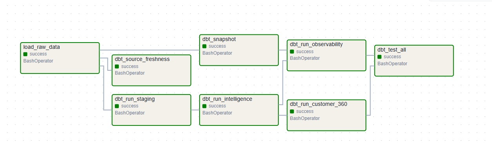
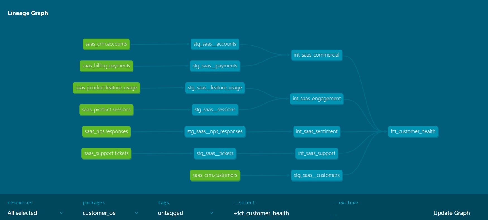
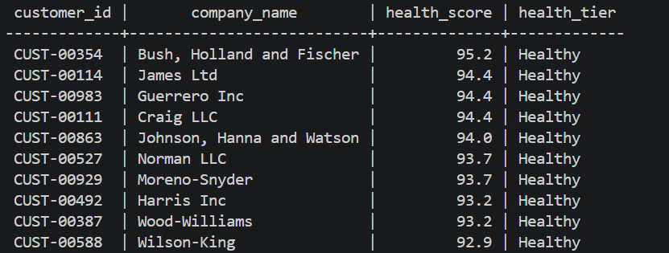

# customerOS

An end-to-end Customer 360 intelligence platform built with Docker, PostgreSQL, dbt, and Apache Airflow.

The project combines SaaS and fintech customer data into a unified Customer 360 model and produces validated customer health and risk scores through a layered data warehouse architecture.

Rather than assigning scores based on assumptions, every scoring model in this project was validated against real business outcomes before being considered complete. During development, two of the original approaches failed validation and had to be redesigned. Those lessons are included below because understanding *why* something didn't work was just as valuable as building the final solution.

---

## Architecture

```text
Source Systems (CSV + PaySim)
        │
        ▼
   raw_db (PostgreSQL)          10 schemas, 1 table per source dataset
        │
        ▼
  staging layer (dbt views)     type casting, column renaming, 15 models
        │
        ▼
intelligence layer (dbt tables) per-pillar signal scoring
        │
        ▼
 customer_360 layer (dbt tables) composite health/risk score + customer tier

Orchestrated end-to-end by an Airflow DAG.
```

### Outcome Variables

| Domain  | Customer 360 Model    | Validated Against       |
| ------- | --------------------- | ------------------------ |
| SaaS    | `fct_customer_health` | `is_churned`             |
| Fintech | `fct_customer_risk`   | `has_repayment_problem`  |

---

## Tech Stack

* **Docker Compose** – Containerized development environment with three PostgreSQL databases and Apache Airflow
* **PostgreSQL 15** – Raw data storage and warehouse
* **dbt Core 1.7.17** – Staging, intelligence, and Customer 360 transformation layers with tests and documentation
* **Apache Airflow 2.9.2** – Orchestrates the complete pipeline
* **Python (pandas + SQLAlchemy)** – Raw data loading using an idempotent truncate-and-reload process that preserves downstream dbt objects

---

## Pipeline

Airflow DAG: `customer_os_pipeline`



1. Load approximately **900,000 rows** across **14 source tables** into the raw database.
2. Build the staging layer with standardized column names and proper data types.
3. Generate customer intelligence signals for each scoring pillar.
4. Combine those signals into Customer 360 health and risk scores.
5. Run automated dbt tests to validate every transformation layer.

The DAG is intentionally unscheduled because the project uses static/generated datasets. Switching to a live source only requires changing the schedule to run automatically.

### Model lineage



Generated via `dbt docs generate` — traces every model from raw source through staging, intelligence, and customer_360.

---

## Data Quality

Before building any models, the pipeline validates the underlying data.

* No duplicate primary keys
* No orphaned foreign keys across all relationships
* More than **37 automated dbt tests** covering uniqueness, referential integrity, accepted values, and null checks
* PaySim fraud data loaded while preserving its expected fraud distribution

---

## Customer 360 preview



`fct_customer_health`, top 10 customers by health score.

---

## Project Status

* ✅ Raw data ingestion (Docker + PostgreSQL)
* ✅ Staging layer (15 dbt models with automated tests)
* ✅ Customer 360 models for both SaaS and fintech (validated and documented)
* ✅ End-to-end Airflow orchestration (8-task DAG)
* ✅ Data observability

  * Source freshness monitoring
  * Row count monitoring
  * Null rate monitoring
  * Schema drift tracking

---

## Observability Layer

A reliable data pipeline doesn't just transform data—it also detects when something has gone wrong. To make the project more production-ready, I added an observability layer that automatically monitors pipeline health on every run.

### Source Freshness

Every raw table is checked using its `_loaded_at` timestamp.

* Warning after **24 hours**
* Error after **72 hours**

The checks were verified end-to-end by manually aging the source data until every monitored table triggered a warning, then reloading fresh data and confirming all checks returned to **PASS** automatically.

### Volume Monitoring

The `obs_row_counts` model records row counts for monitored tables on every pipeline run.

If any required table unexpectedly drops to **zero rows**, an automated dbt test immediately fails the pipeline.

### Null Rate Monitoring

The `obs_null_rates` model tracks null percentages for key identifiers and foreign keys.

The pipeline automatically fails if any monitored column exceeds a **5% null rate**, helping detect broken loads before downstream models are affected.

### Schema Drift Tracking

A dbt snapshot (`schema_snapshot`) monitors `information_schema.columns` across the warehouse.

Instead of recording a new snapshot on every run, it only creates a new version when the schema actually changes—for example when a column is added, removed, renamed, or its data type changes.

This creates a complete audit trail of schema evolution over time without storing unnecessary duplicates.

All four observability checks are integrated into the Airflow DAG and run automatically during every pipeline execution.

---

## Lessons Learned

One of the most valuable parts of this project wasn't building the scoring models—it was validating whether they actually reflected customer behaviour.

### 1. A Case-Sensitivity Bug Hid the Strongest Churn Signal

The SaaS sentiment model originally checked for the values `'promoter'`, `'passive'`, and `'detractor'`.

The dataset actually contained `'Promoter'`, `'Passive'`, and `'Detractor'`.

Because of that mismatch, every customer received the same neutral score of **50**, making sentiment appear completely unrelated to churn.

After fixing the capitalization issue, sentiment became the strongest predictor in the model, with the gap between active and churned customers increasing from **0 points** to **34 points**.

This reinforced how a small data quality issue can completely change the conclusions of an analysis.

---

### 2. The Original Validation Target Was the Wrong Metric

The first version of the fintech risk model was validated against `is_active`.

No matter how the scores were grouped, active and inactive customers looked almost identical. Histograms and score distributions showed no meaningful separation, suggesting the flag wasn't actually measuring customer risk.

Rather than forcing the model to fit the data, I changed the validation target to `has_repayment_problem`, which directly represents missed or defaulted loan payments.

The result was a much clearer separation, with the lowest-scoring customers showing repayment problems in **80–100%** of cases, while high-scoring customers had problem rates below **3.5%**.

Sometimes the problem isn't the model—it's measuring the wrong outcome.

---

### 3. Not Every Intuitive Feature Belongs in the Final Model

KYC verification initially seemed like an obvious risk indicator.

After testing it, I found that every customer with a loan had already completed KYC, meaning the feature couldn't distinguish between low- and high-risk borrowers.

Rather than keeping a feature that added no predictive value, I removed it from the weighted score while retaining it for compliance reporting.

---

### 4. Customer Tiers Were Driven by the Data

The final health and risk tiers weren't based on round numbers like **50**, **70**, or **90**.

Instead, the thresholds were chosen by examining where churn rates and repayment problems changed significantly across score distributions.

For example, the SaaS **Critical** tier captures most churned customers while maintaining a substantially higher churn rate than the overall customer population.

The reasoning behind each weighting and threshold is documented in the corresponding dbt `schema.yml` files.

---

## Running the Project

```powershell
docker compose up -d

docker exec -it customeros-airflow-scheduler-1 airflow dags trigger customer_os_pipeline
```

### Airflow UI

```
http://localhost:8080
```

**Username:** `admin`

**Password:** `admin`
